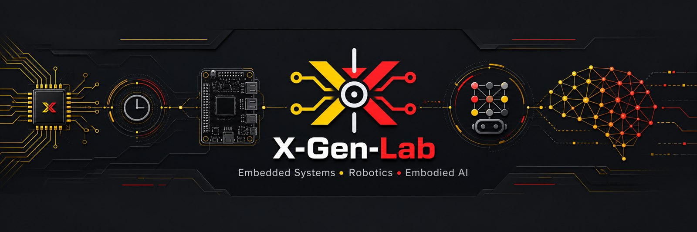

<div align="center">



# X-Gen-Lab

### Next Generation Embedded & Robotics Laboratory

**Building intelligent machines from silicon to intelligence.**

面向嵌入式、机器人与具身智能的开放工程实验室。

`MCU` -> `RTOS` -> `Linux` -> `ROS2` -> `Robotics` -> `Embodied AI`

<br />


</div>

---

## Mission

**X-Gen-Lab** is an open engineering laboratory for the full technology stack behind intelligent machines.

We focus on practical systems: low-level firmware, RTOS platforms, embedded Linux, robot software, and AI capabilities that can eventually run on real machines.

```text
Hardware -> MCU Firmware -> RTOS -> Embedded Linux -> ROS2 -> Robotics -> Embodied AI
```

---

## Technology Roadmap

| Stage | Engineering Focus | Outcome |
| --- | --- | --- |
| **01. Embedded Systems** | STM32, ESP32, nRF52/nRF53, bootloader, OTA, protocols | Reliable device foundations |
| **02. RTOS Platforms** | Zephyr, FreeRTOS, scheduling, IPC, drivers, power management | Production-ready firmware architecture |
| **03. Embedded Linux** | Device drivers, device tree, kernel modules, networking, performance | System-level control and integration |
| **04. Robotics Software** | ROS2, Gazebo, RViz, navigation, control, kinematics | Robot software architecture |
| **05. Embodied Intelligence** | Vision, edge AI, agents, VLMs, robot learning, perception | Intelligence connected to physical systems |

---

## Engineering Domains

<table>
  <tr>
    <td><strong>Firmware</strong></td>
    <td>MCU architecture, board bring-up, peripheral drivers, protocols, OTA, low-power design</td>
  </tr>
  <tr>
    <td><strong>RTOS</strong></td>
    <td>Zephyr, FreeRTOS, scheduling, IPC, memory management, device abstraction</td>
  </tr>
  <tr>
    <td><strong>Linux</strong></td>
    <td>Drivers, device tree, kernel modules, system services, networking, performance tuning</td>
  </tr>
  <tr>
    <td><strong>Robotics</strong></td>
    <td>Motor control, sensor fusion, localization, navigation, ROS2 integration</td>
  </tr>
  <tr>
    <td><strong>AI Systems</strong></td>
    <td>Edge AI, vision models, AI agents, robot perception, embodied intelligence experiments</td>
  </tr>
</table>

---

## Core Projects

Repositories will be linked here as they become public.

| Project | Purpose | Status |
| --- | --- | --- |
| [`xgen-roadmap`](https://github.com/X-Gen-Lab/xgen-roadmap) | Long-term engineering roadmap and lab planning | Active |
| [`xgen-docs`](https://github.com/X-Gen-Lab/xgen-docs) | Knowledge base for embedded, RTOS, Linux, ROS2, robotics, and AI | Active |
| `xgen-balancebot` | Self-balancing robot platform | Planned |
| `xgen-zephyr-platform` | Zephyr-based robot MCU platform | Planned |
| `xgen-linux-lab` | Embedded Linux driver and system learning lab | Planned |
| `xgen-ros2-lab` | ROS2 robotics experiments and architecture examples | Planned |
| `xgen-link` | Embedded device link and communication framework | Planned |
| `xgen-ota` | Production-oriented OTA framework | Planned |

---

## Flagship Project

### X-Gen BalanceBot

A production-oriented robotics platform connecting firmware, control, Linux, ROS2, and AI extension work.

```text
STM32 / nRF53
      +
Zephyr RTOS
      +
Motor Control
      +
Sensor Fusion
      +
ROS2
      +
Jetson / Edge AI
```

| Area | Target |
| --- | --- |
| Robot base | Self-balancing mobile platform |
| Firmware | Zephyr-based control board |
| Control | Motor control and sensor fusion |
| Middleware | ROS2 integration |
| Expansion | Navigation and AI perception ready |

---

## Current Milestones

| Track | Milestone |
| --- | --- |
| Organization | Public profile, roadmap, and repository structure |
| Firmware | Zephyr platform V1 |
| Linux | Driver learning series |
| Robotics | BalanceBot V1 and ROS2 robot framework |
| AI | Vision robot demo and embodied AI prototype |

---

## Principles

```text
Build real systems.
Document engineering decisions.
Prefer reusable architecture over one-off demos.
Connect low-level control with high-level intelligence.
```

---

## Brand Assets

| Asset | File |
| --- | --- |
| Hero banner | `profile/images/xgen-lab-hero.jpg` |
| Organization logo | `profile/images/xgen-lab-logo.png` |
| Editable logo source | `profile/images/xgen-lab-logo.svg` |

---

<div align="center">

### Build | Learn | Share | Innovate

**X-Gen-Lab**

From Embedded Systems to Embodied Intelligence

</div>
